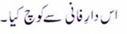
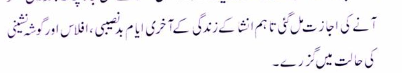

* chatte ko chera hai toh use dang sehne ke liye bhi tayyar rehna chahiye
* `chatta = bee hive`

* hindi ibarat az zabaan mauzune-dilli-ast
* Shams al Bayan. A collection of Urdu Idioms, explained in Persian, with quotations from the poets. By Mirza Jaan Tapish

* Modernist

* `mauqoof = depend upon`
* `ek hungama pe maqoof hai ghar ki raunaq, nauha-e-gham hi sahi naghma-e-shadi na sahi - Ghalib`

* `mustehsan = praised worthy`

* `karakht = dry`

* `daar-e-faani se kooch kiya = departed from this world`
* `daar-e-faani/fanaa = house of mortality`
* `daar-e-baqa = house of eternity`
* `kooch = departed`

* `zarafat = clever in humour, chandler type`

* `taaham = however`
* `gosha-nashiini = seclusion`

## Koi ye keh de - Jigar Moradabadi

* Koi yeh keh de Gulshan Gulshan // Laakh balaaein ek nasheman
* phool khile haiN Gulshan Gulshan // Lekin apna apna Daaman
* ishq hai pyaare khel nahin hai // ishq hai kare-shisha-o-ahan `work of glass and iron`
* aa ki na jaane tujh bin kab se // ruh hai laasha jism hai madfan `grave`
* barq-e-hawdis `lightening of calamities` allah allah // jhun rahi hai shaakh-e-nasheman `nasheman=nest`
* baithe hum har bazm mein lekin // jhaaD ke utthe apna Daaman
* *rangiin fitrat saada tabiyat // farsh-nashin `floor dweller` aur arsh-nasheman `sky dweller`*
* shamma hai lekin dhundli dhundli // saya hai lekin raushan raushan
* kaanton ka bhi haq hai kuchh aakhir // kaun chudae apna daman
* chalti phir chaanw hai pyaare // kis ka sahra kaisa gulshan