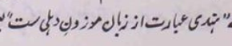

* chatte ko chera hai toh use dang sehne ke liye bhi tayyar rehna chahiye
* `chatta = bee hive`

* hindi ibarat az zabaan mauzune-dilli-ast
* Shams al Bayan. A collection of Urdu Idioms, explained in Persian, with quotations from the poets. By Mirza Jaan Tapish

* Modernist

* `mauqoof = depend upon`
* `ek hungama pe maqoof hai ghar ki raunaq, nauha-e-gham hi sahi naghma-e-shadi na sahi - Ghalib`

* `mustehsan = praised worthy`

* `karakht = dry`

* `zarafat = clever in humour, chandler type`

* Testing how branch push works
